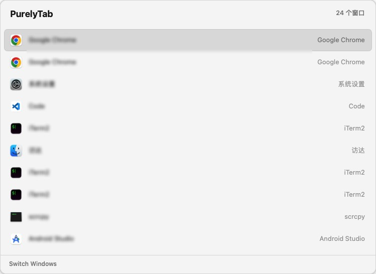
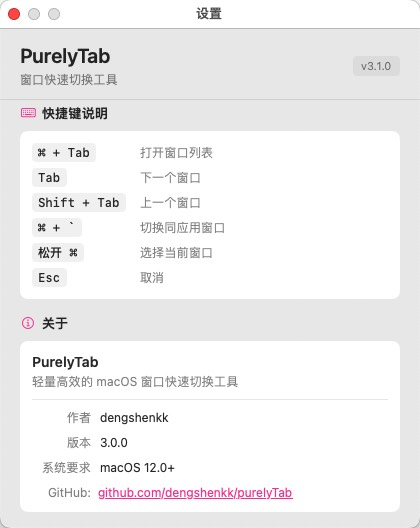

# PurelyTab

<div align="center">
  

  <h3>🚀 轻量高效的 macOS 窗口快速切换工具</h3>
  <h3>A fast & beautiful window switcher for macOS</h3>

  <p>
    <a href="#features">功能 Features</a> •
    <a href="#installation">安装 Installation</a> •
    <a href="#usage">使用 Usage</a> •
    <a href="#sponsor">赞助 Sponsor ❤️</a> •
    <a href="#development">开发 Development</a>
  </p>

  <p>
    
    
    
    
  </p>
</div>

---

<div align="center">
  <h3>🖼️ 效果预览 / Preview</h3>
  <table>
    <tr>
      <td align="center">
        
        <br><em>⌘+Tab 窗口切换 / Window Switcher</em>
      </td>
      <td align="center">
        
        <br><em>简洁的设置界面 / Settings</em>
      </td>
    </tr>
  </table>
</div>

---

## ✨ 功能 / Features

### 🚀 快如闪电 / Fast & Lightweight
- **毫秒级响应** — 按下 ⌘+Tab 瞬间弹出，零延迟
- 纯 Swift 原生实现，资源占用极低
- 优化的 AX 缓存架构，性能比同类快 13 倍
- Instant window switching, pure Swift, ultra-low resource usage

### 🎨 精美界面 / Beautiful Interface
- 毛玻璃半透明设计，自动适配桌面背景
- 多种主题配色可选
- 流畅的过渡动画
- Modern translucent design, multiple themes, smooth animations

### ⌨️ 直观快捷键 / Intuitive Shortcuts
- 使用熟悉的 ⌘+Tab 唤出
- 方向键 / Tab 键导航
- 数字键快速跳转
- Supports ⌘/⌥/⌃ + Tab, arrow key navigation, number shortcuts

### 🖥️ 多显示器 / Multi-Monitor
- 跨屏幕无缝切换
- 支持跟随鼠标位置显示
- Shows windows from all displays, smart positioning

### 🌏 双语言 / Bilingual
- 简体中文 + English 原生支持
- 自动跟随系统语言
- Native Chinese & English, auto-detects system language

### 🔧 可定制 / Customizable
- 缩略图大小、最大列数自由调整
- 背景色、选中色、圆角自定义
- 开机自启、菜单栏图标开关
- Custom thumbnail size, colors, corner radius, behaviors

### 🔄 自动更新 / Auto-Update
- 内置 Sparkle 更新框架
- 一键升级到最新版本
- Built-in auto-updater, one-click update

---

## 📥 安装 / Installation

### 方式一：下载 DMG（推荐）
从 [GitHub Releases](https://github.com/dengshenkk/purelyTab/releases) 下载最新版的 `.dmg` 文件，打开后将 PurelyTab 拖入 Applications 文件夹。

### 方式二：Homebrew（即将支持）
```bash
# Coming soon...
```

### 系统要求
- macOS 12.0 (Monterey) 或更高版本
- Intel 或 Apple Silicon (M1/M2/M3/M4) Mac

---

## ⌨️ 使用 / Usage

### 基本操作

| 快捷键 | 动作 |
|--------|------|
| `⌘ Tab` | 打开窗口切换器，向前循环 |
| `⌘ Shift Tab` | 向后循环 |
| `⌘ \`` | 切换同应用窗口 |
| `← → ↑ ↓` | 在窗口之间导航 |
| `Return` | 选择当前窗口 |
| `Esc` | 取消 |

### 设置

点击菜单栏图标即可访问：
- **切换窗口** — 打开窗口切换器
- **设置** — 自定义外观和行为
- **检查更新** — 升级到最新版本
- **退出** — 关闭 PurelyTab

---

## ❤️ 赞助支持 / Sponsor

**PurelyTab 完全免费开源**。如果这个工具提高了你的工作效率，欢迎赞助支持持续开发 ❤️

**PurelyTab is completely free and open source. If it improves your productivity, please consider sponsoring ❤️**

| 平台 | 链接 | 适用地区 |
|------|------|---------|
| 🌐 GitHub Sponsors | [github.com/sponsors/dengshenkk](https://github.com/sponsors/dengshenkk) | 全球 |
| ⚡ 爱发电 | [afdian.com/a/purelytab](https://afdian.com/a/purelytab) | 中国大陆 |
| 💚 微信赞赏 | 请使用爱发电或 GitHub Sponsors | 中国大陆 |

> 💡 **你的每一份赞助都是对开源的支持，让 PurelyTab 变得更好！**
> **Every sponsorship helps make PurelyTab better!**

---

## 🛠️ 开发 / Development

### 环境要求
- Xcode 14.0+
- Swift 5.5+
- macOS 12.0+

### 从源码构建

```bash
git clone https://github.com/dengshenkk/purelyTab.git
cd purelyTab
./build.sh release
# 产物在 build/PurelyTab.app
```

### 项目结构

```
purelyTab/
├── Sources/
│   ├── PurelyTabApp.swift          # 入口
│   ├── AppDelegate.swift           # 应用代理
│   ├── WindowManager.swift         # 窗口管理
│   ├── HotkeyManager.swift         # 快捷键
│   ├── SettingsManager.swift       # 设置
│   ├── WindowHistoryManager.swift  # 窗口历史
│   ├── LaunchAgentManager.swift    # 开机自启
│   └── UI/
│       ├── WindowSwitcherPanel.swift   # 切换面板
│       └── SettingsView.swift          # 设置页
├── Resources/
│   ├── en.lproj/                   # English
│   └── zh_CN.lproj/                # 简体中文
├── Package.swift
└── build.sh
```

### 贡献

欢迎提交 Pull Request！见 [CONTRIBUTING](https://github.com/dengshenkk/purelyTab/blob/main/CONTRIBUTING.md)。

---

## 📋 路线图 / Roadmap

- [x] ⌘+Tab 窗口切换
- [x] 同应用窗口切换
- [x] 多显示器支持
- [x] 国际化（中/英）
- [x] 多主题
- [x] 开机自启
- [x] 窗口历史栈
- [ ] 窗口按应用分组
- [ ] 自定义快捷键配置
- [ ] 窗口搜索
- [ ] 虚拟桌面支持

---

## 📄 许可证 / License

MIT License © 2024 PurelyTab

---

## 🙏 致谢 / Acknowledgments

- 灵感来自 [AltTab](https://github.com/lwouis/alt-tab-macos)
- 自动更新框架 [Sparkle](https://sparkle-project.org/)
- 图标来自 SF Symbols

---

<div align="center">
  <p>Made with ❤️ for macOS</p>
  <p>
    <a href="https://github.com/dengshenkk/purelyTab">GitHub</a> •
    <a href="https://github.com/dengshenkk/purelyTab/issues">反馈 Bug</a> •
    <a href="https://github.com/dengshenkk/purelyTab/discussions">讨论</a> •
    <a href="#sponsor">赞助 ❤️</a>
  </p>
</div>
